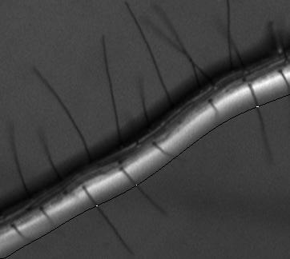
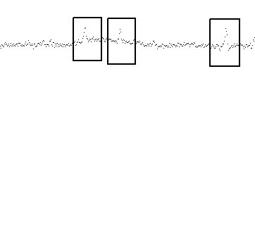
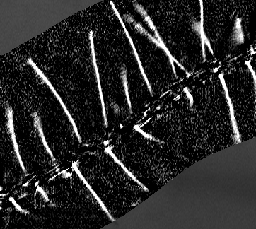
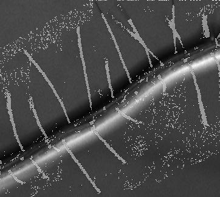
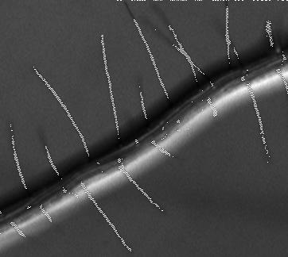
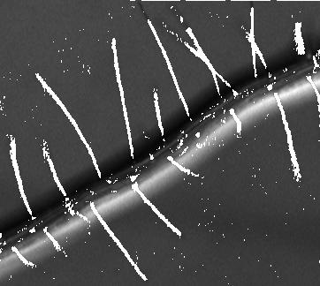

### ImageJ plugin to evaluate root hair expansion(number and size)

Presently the biologists count manually hair by hair, image by image the hairs along the root of a XXXX to evaluate their length and number. This plugin should replace those steps by a single batch operation and generate a simple csv report with all the data that they need.


**Algorithm:**
The first step is to determine the form of the hair using a median filter then generating a binary image using a default threshold. Once we have this image, we can create a function(x) that represent the form of the root ( for the moment, we take all the white pixel, and create a polynomial regression passing by all thoses white pixle).
The main idea is to use this line to read the pixel under the line ( function(x) + delta).
Delta is the parameter to move the line from the root. the hair pixel have to be perpendicular to the root, so moving the root line we should see short variation of color (going to a darker color) that should be part of our hair. The result is show at "color along the line". We use a simple algorithm ( linear regression by steps, recursivly removing the outliers pixels, before to assign a value from 0 to 1 to the pixel ), at this step all the pixels can be part of a hair, we just assign a probability to be part of the hair ( 0.0=not an hair to 1.0=a hair). Once we repeat the operation for all the possible delta we can process those pixel to regroup the hairs, filter them, and detect special pattern like floating hair ,...

**Original image with the line f(x)+B:**

          


**color along the line:**     




**Image of p(Hair), the color of the pixel = p(Hair) multiply by 255:**





----------------------------

### Temporary result:     
experiment using multi polynomial regression to detect outsiders pixels who
can be part of a hair.

##### Image source:     


using: https://github.com/clives/imageJ_hairCountingOverRoot/blob/dda0b5ed8ca0c61878fdf62fe958b80f621ce89e/src/main/scala/algo/outsiderpixel.scala                    

new SearchOutsidersPixelUsingMultiplePolyRegression(50,1)



(still need to remove alone pixel, then regroup the pixel by hair)

###### Better stdDeviation, using diff. linear line and pixels.    

https://github.com/clives/imageJ_hairCountingOverRoot/blob/ee8edc0d0d2dd59a55f8769d42cb8b8a941bdfad/src/main/scala/algo/outsiderpixel.scala        

new SearchOutsidersPixelUsingMultiplePolyRegression(50,1)  



Same algorithm with a small change in the threshold,
before ```threshold = stdDeviation + 5```
now ```threshold = if( stdDeviation < 5 ) 5 else stdDeviation```   
using a step of 1 along delta:



##### Attempt to improve the outlier pixel detection using linear regression:     

1. smooth the data using EMA (exponential movering average). The outliers pixel does have less influent over the regression. Wasn't enough to make a difference.
2. recursive linear regression where the pixels with the higher distance with the line are removed until the stdDeviation of the (line - pixel) goes below &delta; . **Interesting results**. 


More "noise" pixels detected along the root. Could easily be removed checking if a group of pixels are only present over the root ( root contains all pixels of group => remove it )  


